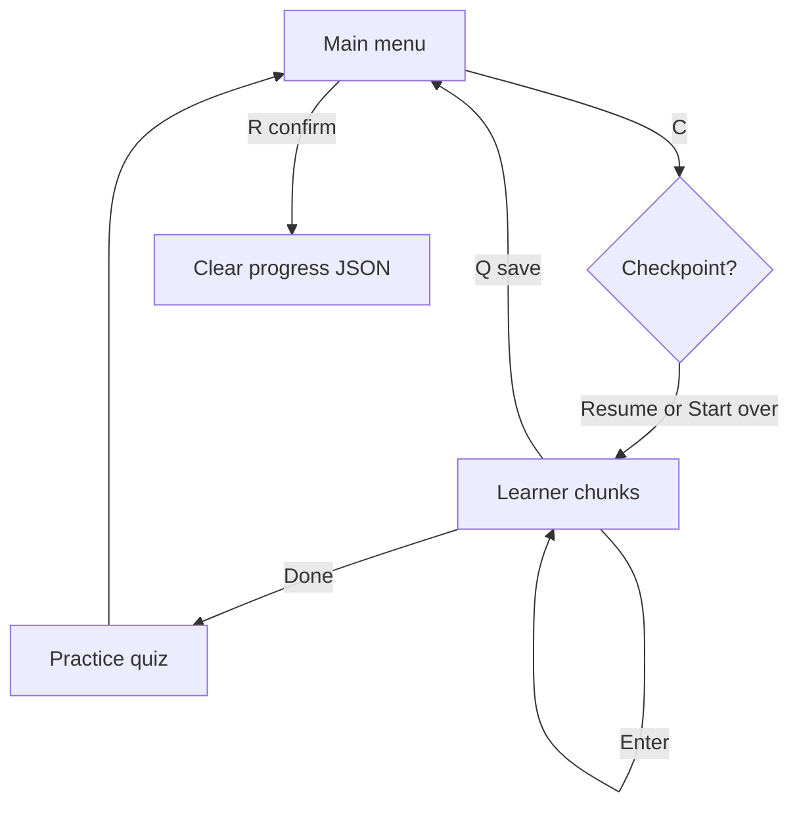

# Friendly theory content + quit / save / reset while reading

## Current issues

- `[data/theory.json](c:\Users\JoseMarulanda\Documents\IstqbApp\istqb_trainer\data\theory.json)` is essentially **PDF extraction**: `FL-x.x.x (K1/K2)`, internal numbering (`1.1.1.`), “Certified Tester / Foundation Level” headers, and long cross-references (“see section 5.1”). That is hard to read in the CLI and feels like source material, not a student guide.
- `[modules/learner.py](c:\Users\JoseMarulanda\Documents\IstqbApp\istqb_trainer\modules\learner.py)` only offers **Enter** between parts; there is no way to **leave mid-chapter** without closing the terminal, and **no saved position** within a chapter.
- `[modules/progress_manager.py](c:\Users\JoseMarulanda\Documents\IstqbApp\istqb_trainer\modules\progress_manager.py)` only tracks `completed_chapters`, scores, and exam attempts—not **which theory chunk** the user last saw.
- Running `[scripts/build_data.py](c:\Users\JoseMarulanda\Documents\IstqbApp\istqb_trainer\scripts\build_data.py)` / `[content_build.build_from_pdf_dir](c:\Users\JoseMarulanda\Documents\IstqbApp\istqb_trainer\modules\content_build.py)` **overwrites** `theory.json` from the syllabus PDF, which would erase any hand-curated theory unless we change that behavior.

## 1. Curated “student edition” theory (content)

**Goal:** Same **seven chapter ids and titles** (1–6 CTFL areas + 7 practice intro) so `[questions.json](c:\Users\JoseMarulanda\Documents\IstqbApp\istqb_trainer\data\questions.json)` chapter mapping stays valid. Replace `content_chunks` with **shorter, plain-language sections** that:

- Explain ideas in **logical teaching order** (intro → core ideas → examples/lists where useful).
- **Remove** syllabus-internal scaffolding: no `FL-…` lines, no `1.2.3.` headings as primary structure (optional short human headings like “Why testing matters” inside prose are fine).
- **Strip** repeated PDF boilerplate (“Certified Tester”, page footers).
- **Soften** cross-references (“covered later in this course” instead of “see section 5.1”) where needed.
- Add **one short attribution chunk** (e.g. end of chapter 1 or first chunk of file): study text is aligned with **ISTQB CTFL** and intended for exam prep; official syllabus remains the authority.

**How to produce the JSON:** Implement as a **committed replacement** of `[data/theory.json](c:\Users\JoseMarulanda\Documents\IstqbApp\istqb_trainer\data\theory.json)` (target roughly **6–12 chunks per syllabus chapter**, ~900 chars max per chunk to match `[_chunk_text](c:\Users\JoseMarulanda\Documents\IstqbApp\istqb_trainer\modules\pdf_parser.py)` style already used elsewhere). This is editorial work (can be done in the agent session as structured JSON); it is **not** a runtime LLM call.

## 2. Protect curated theory from PDF rebuilds

In `[modules/content_build.py](c:\Users\JoseMarulanda\Documents\IstqbApp\istqb_trainer\modules\content_build.py)` / `[scripts/build_data.py](c:\Users\JoseMarulanda\Documents\IstqbApp\istqb_trainer\scripts\build_data.py)`:

- **Default:** regenerate **questions only** from PDFs; **load existing `data/theory.json`** and write it back unchanged (or skip theory write).
- **Opt-in:** e.g. `--theory-from-pdf` to rebuild theory from the syllabus (current behavior) when a maintainer explicitly wants it.

Document in the build script docstring and `[.env.example](c:\Users\JoseMarulanda\Documents\IstqbApp\istqb_trainer\.env.example)` briefly.

## 3. Progress model: reading checkpoint

Extend `[ProgressState](c:\Users\JoseMarulanda\Documents\IstqbApp\istqb_trainer\modules\progress_manager.py)` with something like:

- `theory_chunk_index: dict[str, int]` — per **chapter id** (string key), **0-based index** of the next chunk to show (or last completed; pick one convention and use consistently).

Add helpers: `get_theory_chunk(chapter_id)`, `set_theory_chunk(chapter_id, index)`, `clear_theory_progress()` (optional), `reset_all_progress()` for full reset.

**When to update:** After each displayed chunk (or on quit), save the **next** index so resume continues correctly. When the user **finishes** the learning phase (after last chunk, before practice), clear checkpoint for that chapter (or set to 0 for next visit).

## 4. Learner UX: quit / save / menu

Update `[modules/learner.py](c:\Users\JoseMarulanda\Documents\IstqbApp\istqb_trainer\modules\learner.py)`:

- Change the prompt from “Enter only” to something like: **Enter** = next part, **Q** = **return to main menu** (progress manager saves checkpoint + existing chapter completion unchanged).
- Optionally **S** = **start this chapter’s reading from the beginning** (reset checkpoint for this chapter only).
- Return a small result enum or string: `completed`, `quit`, `restart_reading` so `[main.py](c:\Users\JoseMarulanda\Documents\IstqbApp\istqb_trainer\main.py)` can call `pm.save()` and skip practice if the user quit before the end.

Add a helper in `[utils/helpers.py](c:\Users\JoseMarulanda\Documents\IstqbApp\istqb_trainer\utils\helpers.py)` e.g. `read_learning_command()` returning `next | quit | restart`.

**Resume prompt:** When the user chooses **Continue** for a chapter with a checkpoint `> 0`, ask once: **Resume from part N** vs **Start from beginning**.

## 5. Main menu: reset progress

In `[main.py](c:\Users\JoseMarulanda\Documents\IstqbApp\istqb_trainer\main.py)`, add e.g. **[R] Reset progress** with a **strong confirmation** (type `RESET` or `yes`) before clearing `completed_chapters`, `scores_per_chapter`, `exam_attempts`, and `theory_chunk_index`, then `pm.save()`.

## 6. Flow (mermaid)

## Files to touch

| File                                                                                                                                                                                                                      | Change                                                                                    |
| ------------------------------------------------------------------------------------------------------------------------------------------------------------------------------------------------------------------------- | ----------------------------------------------------------------------------------------- |
| `[data/theory.json](c:\Users\JoseMarulanda\Documents\IstqbApp\istqb_trainer\data\theory.json)`                                                                                                                            | Replace with curated study-guide chunks (7 chapters).                                     |
| `[modules/progress_manager.py](c:\Users\JoseMarulanda\Documents\IstqbApp\istqb_trainer\modules\progress_manager.py)`                                                                                                      | New fields + reset helpers + backward-compatible JSON load (default empty dict).          |
| `[modules/learner.py](c:\Users\JoseMarulanda\Documents\IstqbApp\istqb_trainer\modules\learner.py)`                                                                                                                        | Checkpoint-aware loop + Q/S commands; return status.                                      |
| `[utils/helpers.py](c:\Users\JoseMarulanda\Documents\IstqbApp\istqb_trainer\utils\helpers.py)`                                                                                                                            | Input helper for learning commands.                                                       |
| `[main.py](c:\Users\JoseMarulanda\Documents\IstqbApp\istqb_trainer\main.py)`                                                                                                                                              | Wire checkpoint save/resume; call practice only if learning completed; add **[R] Reset**. |
| `[modules/content_build.py](c:\Users\JoseMarulanda\Documents\IstqbApp\istqb_trainer\modules\content_build.py)` + `[scripts/build_data.py](c:\Users\JoseMarulanda\Documents\IstqbApp\istqb_trainer\scripts\build_data.py)` | Default preserve theory; flag to rebuild theory from PDF.                                 |
| `[.env.example](c:\Users\JoseMarulanda\Documents\IstqbApp\istqb_trainer\.env.example)`                                                                                                                                    | One line on curated theory + build flags if needed.                                       |

## Risk / note

Rewriting six full syllabus areas into concise study text is **substantial editorial work**; the plan keeps exam alignment but does not copy long ISTQB wording verbatim. If you need maximum legal safety, keep the attribution chunk and avoid long quotations from the PDF.